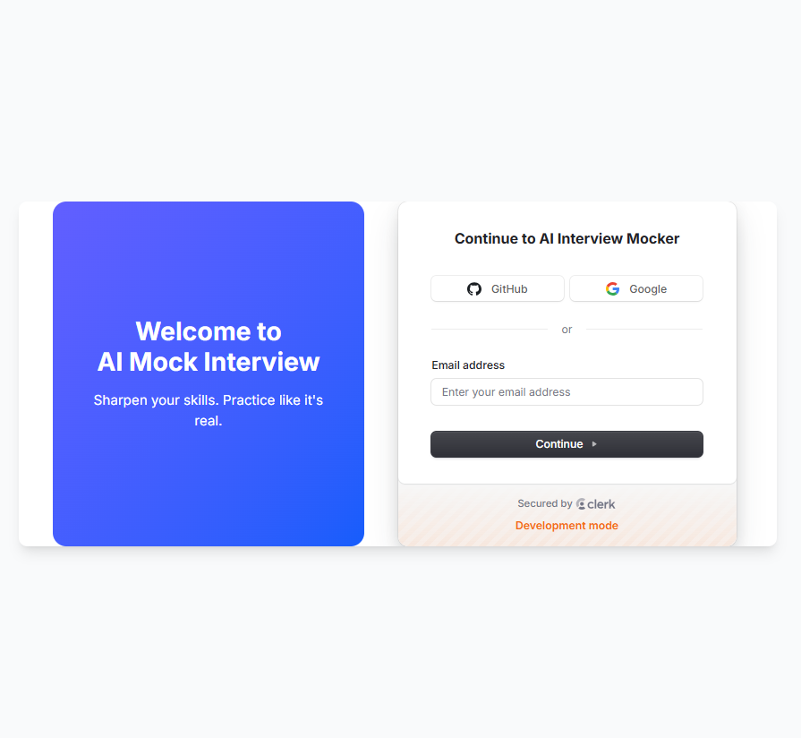
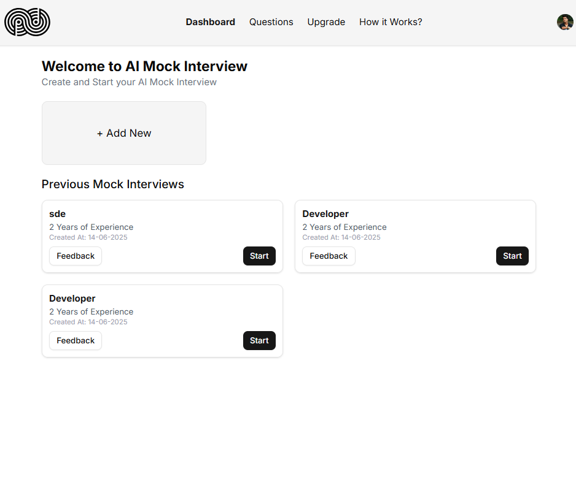
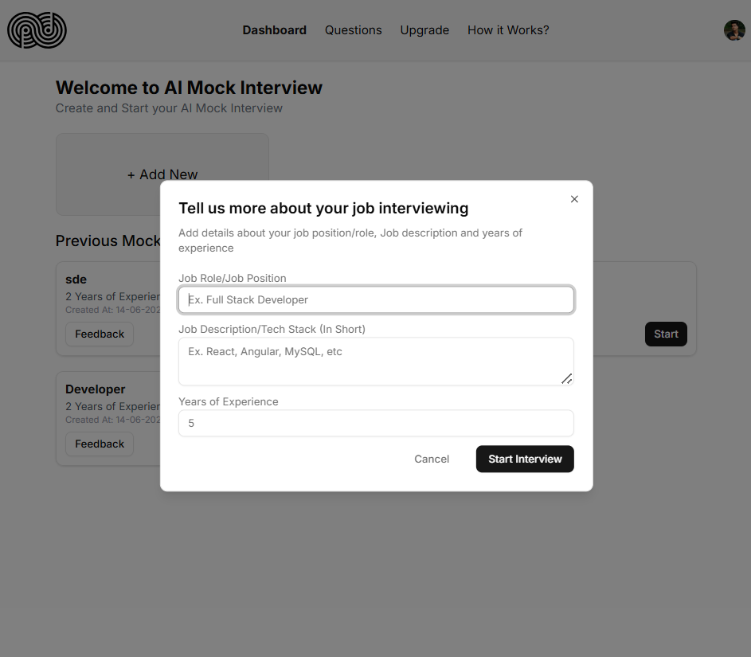
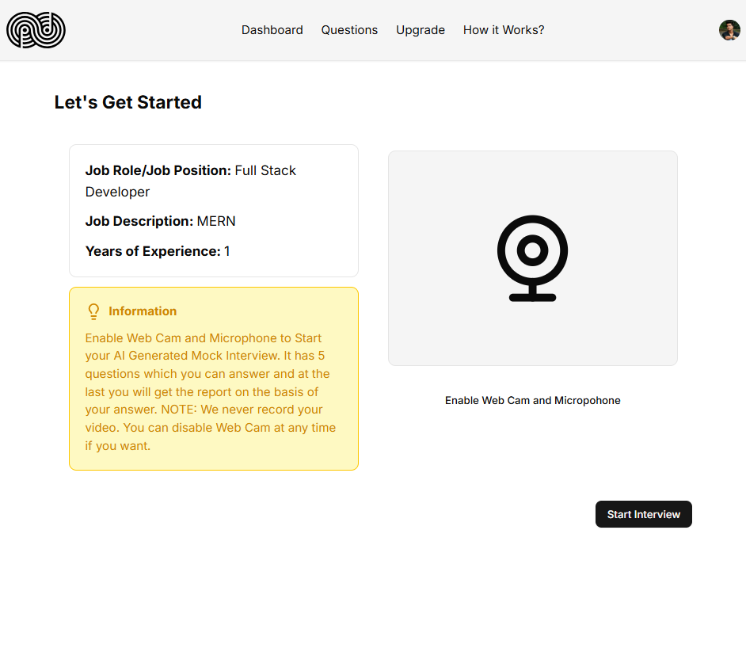
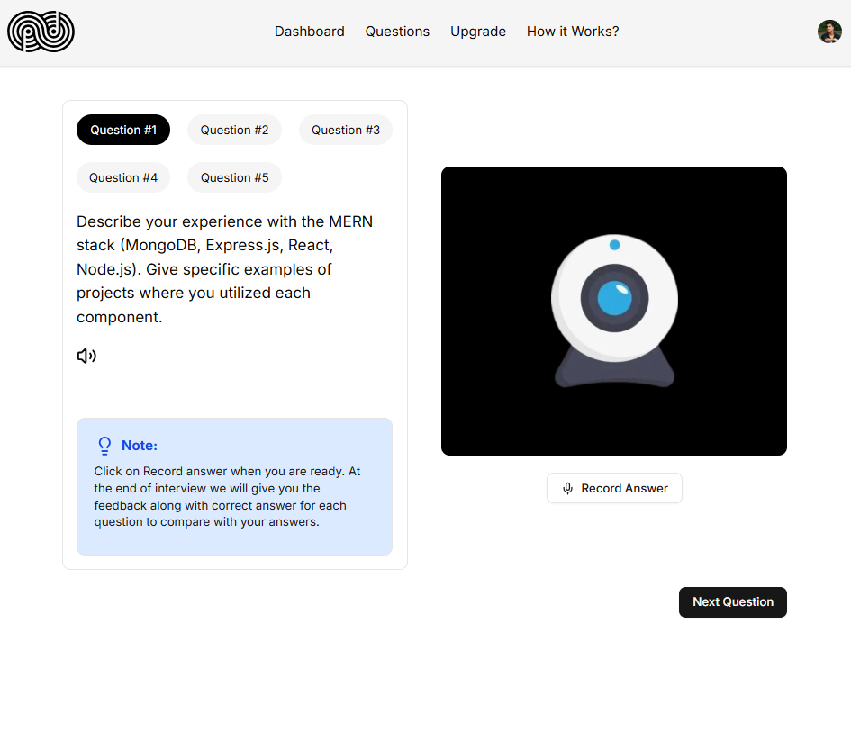
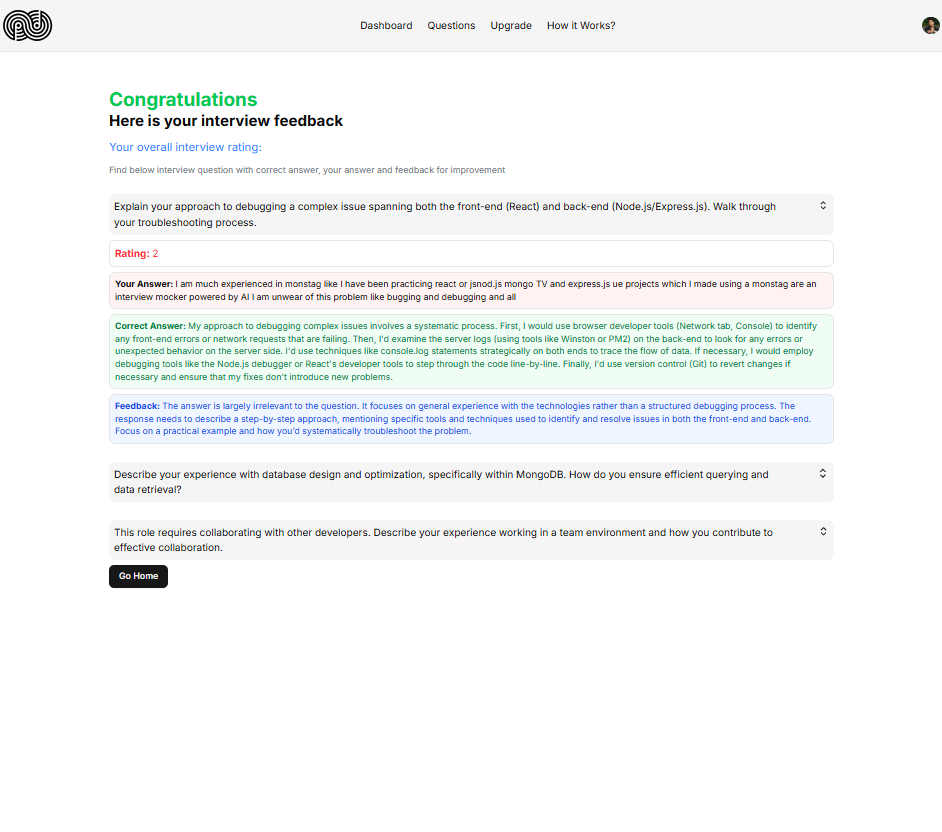

# **AI Mock Interview**
[](https://ai-interview-mocker-phi-teal.vercel.app/)

An AI-powered web app that simulates job interviews with real-time responses and feedback, helping users practice effectively using Gemini AI. Built with **[Next.js](https://nextjs.org)**, **Tailwind CSS**, **JavaScript**, and **Clerk**.

# **Login Page**


# **Dashboard**


# **Add New Interview**


# **Interview Landing Page**


# **Generate Questions and Record your Answers**


# **Interview Feedback**


## 🧰 Tech Stack

- [Next.js](https://nextjs.org/)
- [JavaScript]
- [Tailwind CSS](https://tailwindcss.com/)
- [Clerk](https://clerk.dev/)
- [Gemini AI](https://ai.google.dev/)
- [Drizzle ORM](https://orm.drizzle.team/)


## 📁 Folder Structure

```
AI-Interview-mocker/
├── app/
│   ├── (auth)\sign-in\[[...sign-in]]
│   |   └── page.jsx
│   ├── dashboard/
│   │   ├── _components/
│   |   |   ├── AddNewInterview.jsx
│   |   |   ├── Header.jsx
│   |   |   ├── InterviewItemCard.jsx
│   |   |   ├── InterviewList.jsx
│   │   ├── howItWorks/page.jsx
│   │   ├── interview\[interviewId]/
│   |   |   ├── feedback/page.jsx
│   |   |   ├── start/
│   |   |   |   ├── _component/
│   |   |   |   |   ├── QuestionSection.jsx
│   |   |   |   |   ├── RecordAnswerSection.jsx
│   |   |   |   ├── page.jsx
│   |   |   ├── page.jsx
│   │   ├── question/page.jsx
│   │   ├── upgrade/page.jsx
│   |   ├── layout.jsx
│   |   ├── page.jsx
│   └── global.css
|   └── layout.js
|   └── page.js
├── components\ui
│   ├── button.jsx
│   ├── collapsible.jsx
│   ├── dialog.jsx
│   ├── input.jsx
│   ├── sonner.jsx
│   ├── textarea.jsx
├── drizzle
├── lib/utils.js
├── db/
├── public/
│   └── images/
├── utils
|   ├── db.js
|   ├── GeminiAIModel.js
|   ├── schema.js
├── .env.local
├── components.json
├── drizzle.config.js
├── jsconfig.json
├── middleware.js
├── next.config.mjs
├── package-lock.json
├── package.json
├── postcss.config.mjs
├── README.md
├── tailwind.config.js
```

---
## 🤝 Contributing

Contributions are welcome! Open issues, submit PRs, and improve the platform together.

---

## 📄 License

Licensed under the [MIT License](LICENSE).

---
